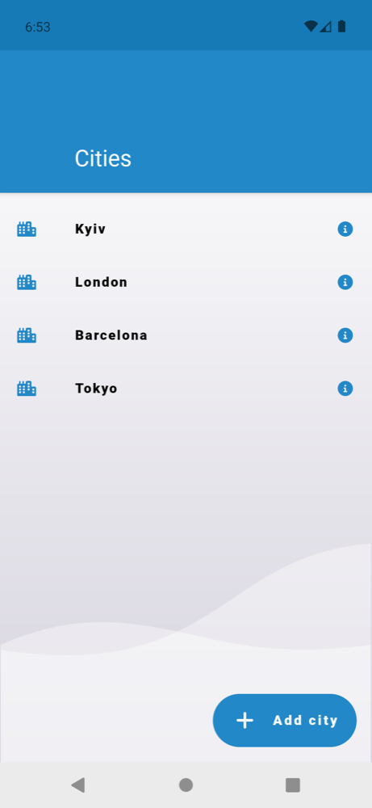
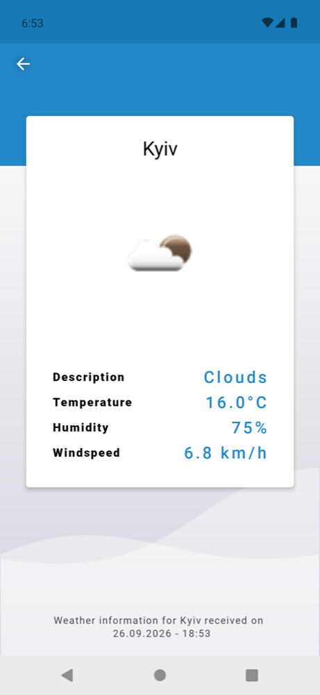
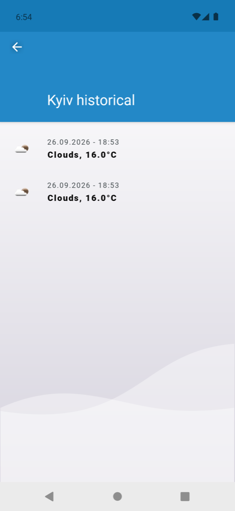
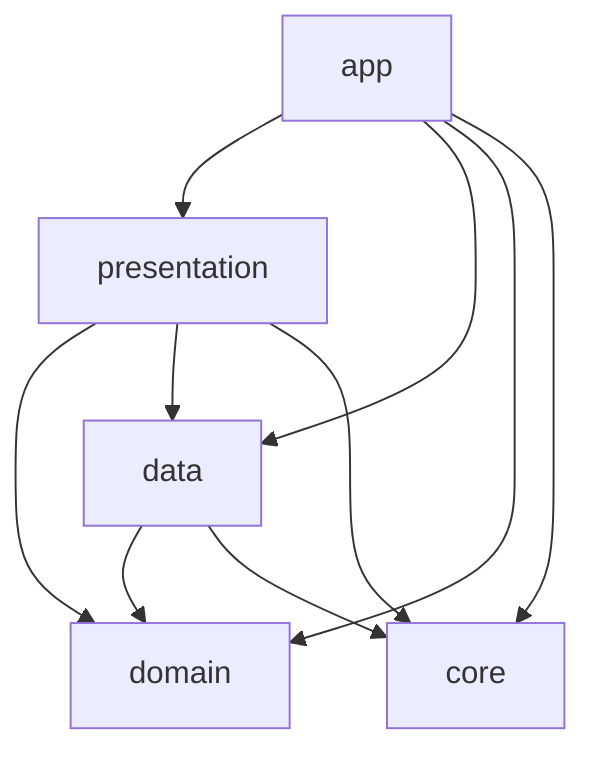

# Weather

## Table of contents

- [About](#about)
  - [Screenshots](#screenshots)
  - [Design decisions](#design-decisions)
- [Architecture](#architecture)
  - [Modules](#modules)
  - [Module dependencies](#module-dependencies)
  - [Data source](#data-source)
- [Tech stack](#tech-stack)
- [Testing](#testing)
  - [Test coverage](#test-coverage)
  - [Test data](#test-data)
- [Getting started](#getting-started)

## About

An Android app that shows the current weather for saved cities and keeps a local history of every
request. Developed as part of a code challenge:
https://drive.google.com/drive/folders/1_W2KAlPHtoZ2tIJTe5JzM-IarDuKQfNQ?usp=share_link

The goal of this project is not to create an app that solves a real-world problem, but rather to
demonstrate a part of my hard skills and a deep understanding of Android application architecture.

The project is designed to be reliable, stable, highly testable, and easily extendable. However,
due to the simplicity of the task, I deliberately deviated from certain Clean Architecture
principles in order to avoid making the project needlessly complex or inappropriate for its scope.

I am happy to explain any decision made in this project, as well as what I would add, change,
or improve if this were a production-level project. Feel free to reach out to discuss or
challenge any of them.

### Screenshots

| Cities                                 | Weather details                                  | Weather history                                  |
|----------------------------------------|--------------------------------------------------|--------------------------------------------------|
|  |  |  |

### Design decisions

- **Unidirectional data flow.** Every ViewModel exposes a single immutable `UIState` via
  `StateFlow` and accepts user actions through a single `onUserEvent` entry point, where every
  action is described by a sealed `UserEvent` interface.
- **Explicit screen data state.** Screen data is modeled by the sealed `ScreenDataState` class
  (`Empty`, `Loading`, `Success`, `Error`), so the UI always renders one well-defined state.
- **One-off UI events as part of state.** Navigation and other one-off events are delivered as
  `Event` inside `UIState` and are removed after the UI reports them as performed. Events are
  queued, so none of them is lost or skipped. Unlike `Channel` or `SharedFlow`, this approach does
  not lose events on configuration changes or when the UI is not collecting.
- **Offline history.** Every successful API response is saved to the Room database, so any history
  record can be opened later without a network connection. The details screen receives a
  `DataSourceType` (`LOCAL` or `REMOTE`) and loads data from the corresponding source.
- **Typed errors.** Repositories wrap results in `Result` and map HTTP and database failures to
  the sealed `ApiError` and `DbError` classes, so the UI can show a specific message for each case.
- **Data source abstraction.** Repositories depend on local and remote data source interfaces,
  which makes them easy to test with fakes and allows replacing the storage or the API without
  touching the repository contracts.
- **Pure domain logic.** Unit conversions (Kelvin to Celsius, m/s to km/h), date formatting and
  icon URL building live in the `domain` module and are exposed as use cases.
- **Injected dispatchers.** Coroutine dispatchers are provided via the `@IoDispatcher`,
  `@MainDispatcher` and `@DefaultDispatcher` qualifiers, so they can be replaced with test
  dispatchers in unit tests.

## Architecture

The project follows a simplified Clean Architecture with MVVM + MVI in the presentation layer
and is split into Gradle modules by layer.

### Modules

| Module         | Responsibility                                                                                               |
|----------------|--------------------------------------------------------------------------------------------------------------|
| `app`          | Application class and the root Dagger component that wires all modules together.                             |
| `presentation` | Fragments, ViewModels, adapters, UI state and events, screen models and mappers from domain entities.        |
| `domain`       | Pure Kotlin module with entities, repository interfaces, use cases, converters and formatters.               |
| `data`         | Repository implementations, Room database, Retrofit API, local and remote data sources, mappers, DI modules. |
| `core`         | Shared utilities, such as coroutine dispatchers and their DI module.                                         |

### Module dependencies

`domain` is the core of the application and does not depend on any other project module.
All other layers depend on it, while `app` wires everything together:



- `domain` is a pure Kotlin module without any Android framework dependencies.
- `presentation` depends on `domain`, `data` and `core`, and works with use cases and domain
  models. It uses `data` only for the typed `ApiError` and `DbError` classes.
- `data` depends on `domain` and `core`, and implements the repository interfaces declared there,
  so the dependency between `domain` and `data` is inverted.
- `core` contains shared utilities and does not depend on any other project module.
- `app` depends on all modules in order to assemble the Dagger dependency graph. `presentation`
  gets access to it through the `PresentationAppComponentProvider` interface, which is
  implemented by the `Application` class.

### Data source

Weather data comes from the real
[OpenWeatherMap Current Weather API](https://openweathermap.org/current). Cities and weather
history are stored locally in a Room database. There are no mocks in the app itself.

Current weather:

`CityWeatherDetailsViewModel` → `GetActualCityWeatherDetailsUseCase` → `CityWeatherDetailsRepository`
→ `RemoteCityWeatherDetailsDataSource` → `CityWeatherDetailsApi`

The result is then saved via `LocalCityWeatherDetailsDataSource` and appears in the weather
history.

Saved cities and weather history:

`ViewModel` → `UseCase` → `Repository` → `LocalDataSource` → `Dao` → `WeatherDatabase`

## Tech stack

- **Language:** Kotlin 1.9
- **UI:** View system, ViewBinding, Material Components, RecyclerView, Picasso
- **Navigation:** Navigation Component, Safe Args
- **Architecture:** simplified Clean Architecture, MVVM + MVI
- **Jetpack:** ViewModel, Lifecycle, Fragment KTX, Room, Core KTX
- **Asynchrony:** Kotlin Coroutines, StateFlow
- **Dependency injection:** Dagger 2
- **Network:** Retrofit, Gson
- **Testing:** JUnit 4, kotlinx-coroutines-test
- **Build:** Gradle 8.6 (Kotlin DSL), Android Gradle Plugin 8.4, version catalog, kapt

## Testing

### Test coverage

Unit tests use hand-written fakes instead of mocking frameworks and cover:

- `domain` — temperature and speed converters, date and icon URL formatters, and rounding in the
  conversion use cases.
- `data` — mappers and repositories, including how HTTP and database failures are mapped to
  typed errors.
- `presentation` — `CitiesViewModel`, `CityWeatherDetailsViewModel` and
  `CityWeatherHistoryViewModel`: loading and error states, user events, navigation events and
  their order.

To run them:

```bash
./gradlew test
```

### Test data

No credentials are required. Add any city name supported by OpenWeatherMap (for example,
`London`, `Berlin` or `Kyiv`) to fetch its current weather. An unknown city name results in a
"not found" error.

## Getting started

### Requirements

- JDK 17
- Android SDK 34
- Device or emulator with Android 9 (API 28) or higher and internet access

### Android Studio

1. Clone the repository:
   ```bash
   git clone https://github.com/yehor-levchenko/Weather.git
   ```
2. Open the project root in Android Studio (Jellyfish or newer) and wait for Gradle sync to finish.
3. Select the `app` run configuration and press **Run**.

### Command line

```bash
./gradlew installDebug
```

### API key

No setup is needed. The OpenWeatherMap API key is committed intentionally in `gradle.properties`,
so the project builds and works right after cloning. In a production project, the key would come
from `local.properties` or CI secrets.
